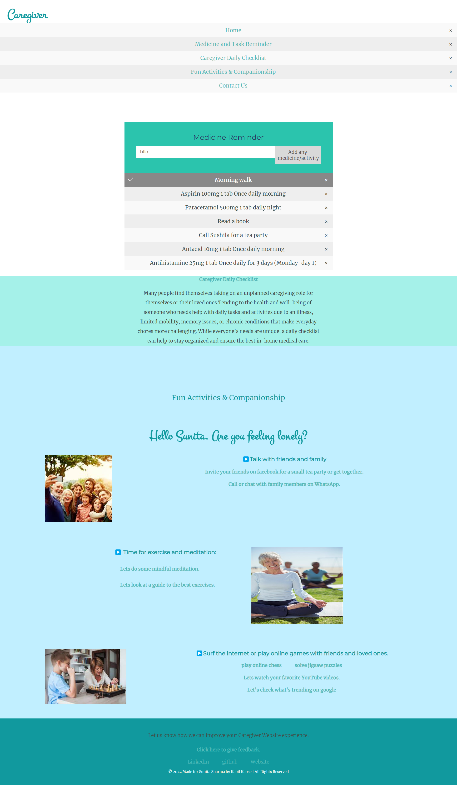

# Caregiver

Caregiver is a web based application for Sunita Sharma (65+ years old) to help her to live healthier and better life.

Many people find themselves taking on an unplanned caregiving role for themselves or their loved ones.Tending to the health and well-being of someone who needs help with daily tasks and activities due to an illness, limited mobility, memory issues, or chronic conditions that make everyday chores more challenging.Caregiver website can help to stay organized and ensure the best in-home medical care.

### Feature
- Medicine Reminder 
- Task and Activity Reminder
- Caregiver Daily Checklist(Records heart rate and calories burned and mail these details to Sunita’s doctor and son daily.)
- Entertainment 
- Link to Meditation site
- Guide to the best exercises 
- Fun Activities 
- Companionship
- Link to play online chess and solve jigsaw puzzles with family and friends 
- Regular feedback to improve user experience 

### Screenshots

